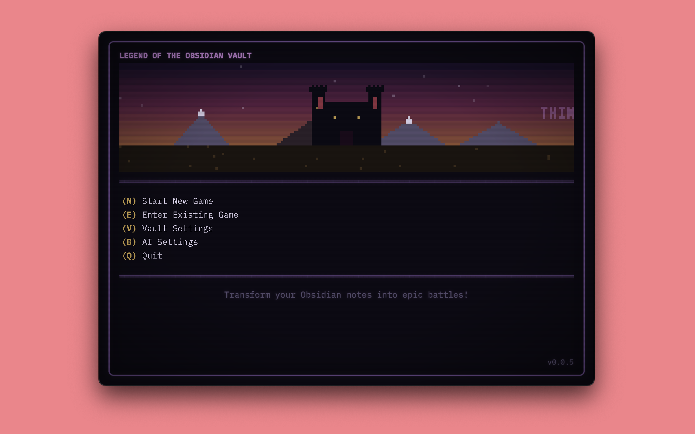
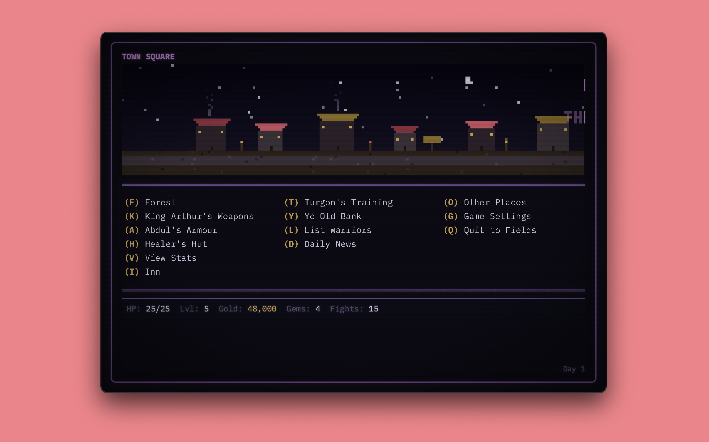
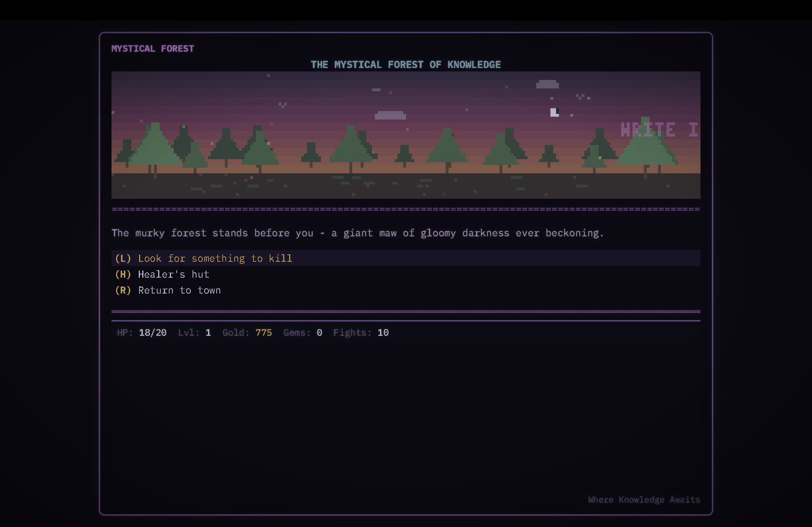
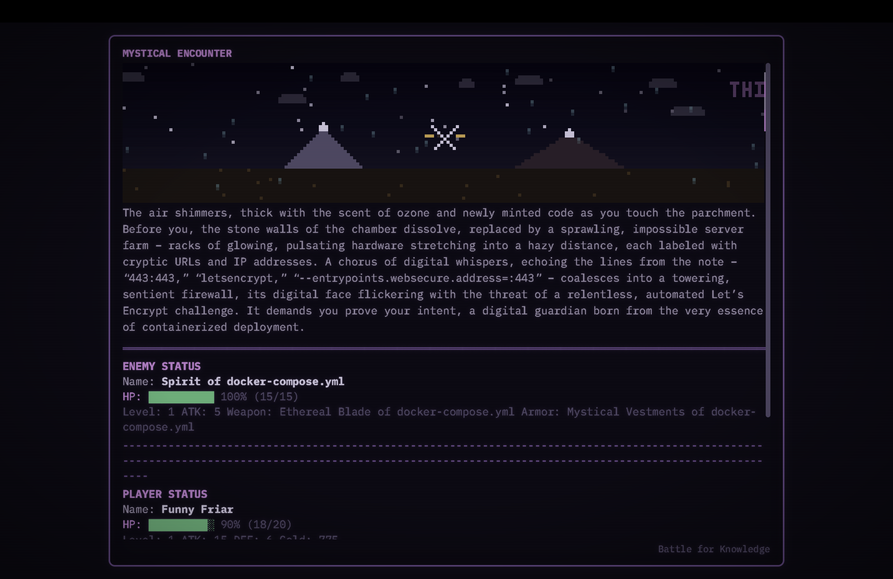

# LOOV: Legend of the Obsidian Vault

> A LORD-inspired knowledge RPG that transforms your Obsidian vault into a living dungeon.

Transform your forgotten notes into epic forest battles. This authentic BBS-styled game recreates the classic Legend of the Red Dragon experience as a desktop app, where AI generates rich, immersive encounters from your actual knowledge base.


## Quick Start

### Prerequisites
- **Node.js 18+** and **npm**
- **Python 3.9+** with `pip`
- **Obsidian vault** (optional -- uses demo vault if none found)

### Installation

```bash
git clone https://github.com/snedea/legend-of-obsidian-vault.git
cd legend-of-obsidian-vault

# Install Node dependencies (Electron + React)
npm install
cd frontend && npm install && cd ..

# Install Python dependencies (FastAPI backend)
pip install -r requirements.txt
```

### Run in Development

```bash
# Browser mode (backend + frontend)
npm run dev

# Desktop mode (Electron + backend + frontend)
npm run electron:dev
```

### Build for macOS

```bash
npm run build    # Produces .dmg in dist/
```

## Features

### Core Gameplay
- Authentic LORD v4.00a combat formula and mechanics
- 3 character classes: Death Knight, Mystical, Thieving
- 15-tier weapon and armor progression with authentic pricing
- Forest combat with note-based enemies
- Knowledge quiz attacks for 2x critical hit damage
- SQLite save system with persistent character data

### Obsidian Integration
- Auto-detects vaults (iCloud, ~/Documents, common locations)
- Converts notes into contextual enemies
- Note age influences enemy difficulty
- AI generates quiz questions from note content

### AI-Enhanced Combat
- **Ollama integration** for narrative generation and quiz questions
- Rich encounter descriptions incorporating note content
- Smart answer validation (semantic matching, not just exact)
- Graceful fallback to template narratives when AI is unavailable

### LORD Secrets
- **Jennie Codes**: 13 hidden commands in the Forest
- **8 IGM locations**: Cavern, Barak's House, Fairy Garden, Xenon Storage, WereWolf Den, Gateway Portal, and more
- **Bank robbery** system (requires Thief class + Fairy Lore)
- **WereWolf curse** for PvP enhancement
- **Gateway Portal** dimensional travel adventures

### Desktop App
- Electron shell with macOS-native titlebar
- Animated pixel art scene headers for all 28 screens
- CRT overlay effects for retro aesthetic
- Canvas-based rendering engine with 4x pixel art

## Screenshots

| Main Menu | Town Square |
|:-:|:-:|
|  |  |

| Mystical Forest | Combat |
|:-:|:-:|
|  |  |

## Architecture

```
legend-of-obsidian-vault/
├── electron/               # Electron main process + Python subprocess manager
├── frontend/               # React 19 + TypeScript + Vite
│   └── src/
│       ├── screens/        # 28 game screens
│       ├── canvas/         # Pixel art scene engine (28 scenes)
│       ├── components/     # Shared UI components
│       ├── context/        # GameContext (central state)
│       └── services/       # API client (api.ts)
├── backend/                # FastAPI Python server
│   ├── routers/            # REST endpoints (character, combat, town, etc.)
│   └── services/           # Business logic
├── game_data.py            # Core game mechanics, combat formula, items
├── obsidian.py             # Vault scanning and enemy generation
├── brainbot.py             # AI integration (Ollama, TinyLlama)
├── fantasy_translator.py   # Technical-to-fantasy term translation
├── demo_vault/             # Example notes for testing
└── requirements.txt        # Python dependencies
```

The FastAPI backend delegates to the root-level Python modules (`game_data.py`, `obsidian.py`, `brainbot.py`) for all game logic. The React frontend communicates via REST API.

## How to Play

1. **Create a character** -- choose name, gender, and class
2. **Enter the Forest** -- encounter enemies generated from your notes
3. **Fight or Quiz** -- use regular attacks or quiz attacks for 2x damage
4. **Level up** -- visit shops, train with masters, explore IGM locations
5. **Discover secrets** -- try Jennie codes in the Forest, rob the bank, learn Fairy Lore

## Development

```bash
# Backend only
npm run backend:dev        # FastAPI on port 8742

# Frontend only
npm run frontend:dev       # Vite on port 5173

# Full stack
npm run dev                # Both, in browser
npm run electron:dev       # Both, in Electron
```

## Credits

- **Original LORD**: Seth Able Robinson
- **Combat Formula**: [RT Soft LORD FAQ](https://www.rtsoft.com/pages/lordfaq.php)
- **AI**: Ollama / TinyLlama for local inference

## License

MIT License -- see [LICENSE](LICENSE) for details.
